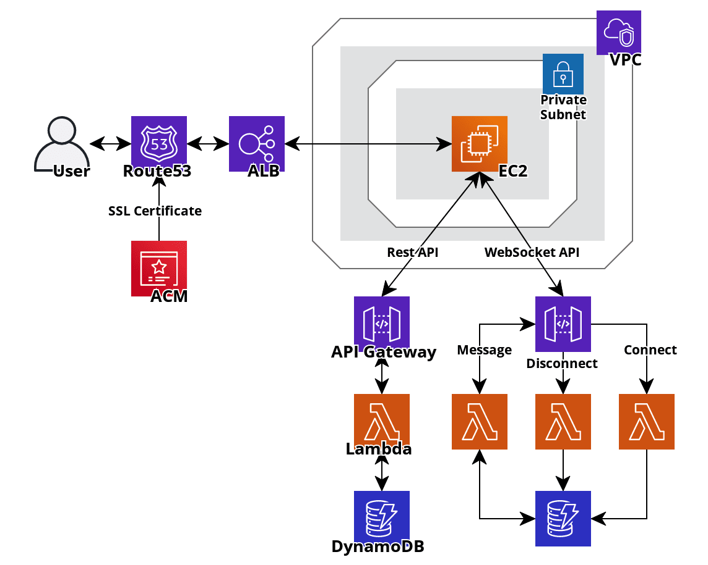

# Web meeting app for Ogiri
This application was developed in KDDI DIGITAL GATE Hackathon 2020 Autumn (2 days).  
The theme of the hackaton was that "Design an exciting future for communication".  
We developed a new kind of meeting application that organizes the Ogiri with people in remote locations.  

## Technologies Used
- Amazon Web Services (See "Architecture" section for more information.)
- Skyway SDK

## Architecture

## Team Member
- [nyax](https://github.com/213yuka)
- [kkasiwagi](https://github.com/116014)
- [haruki yoshida](https://github.com/yoshiyoshiharu)
- [Yuki Watanabe](https://github.com/wattah1002)
- [Taiga Matsunaga](https://github.com/Tiger-0512)

## Acknowledgement
In this hackaton, staff of KDDI CORPORATION helped us a lot. We are grateful for their support.
